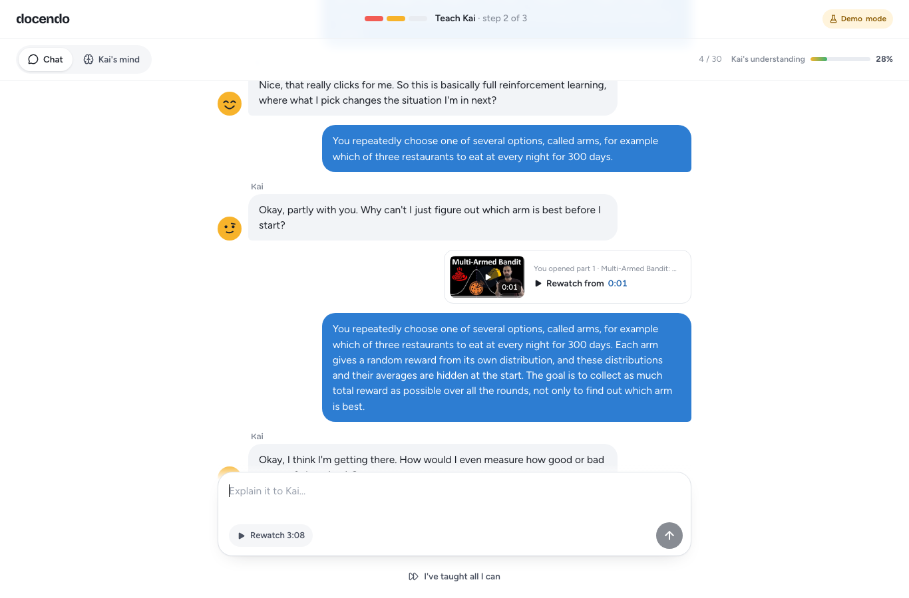
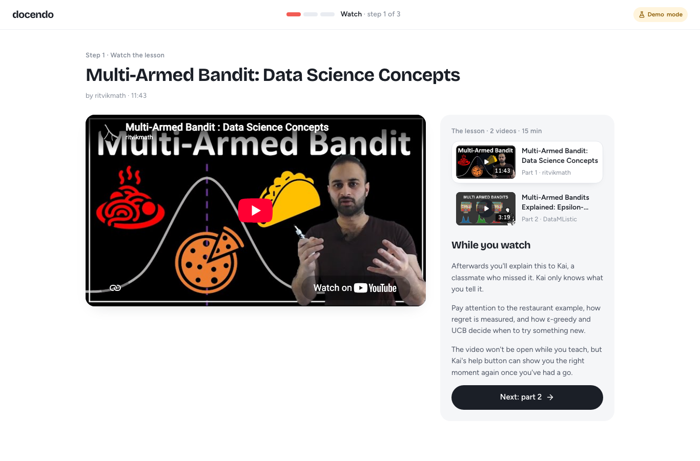
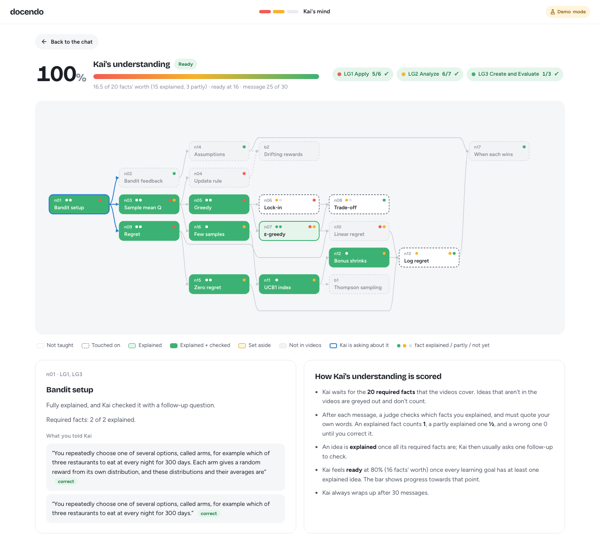

<h1>&nbsp;Docendo</h1>

> ***Docendo discimus***: by teaching, we learn.<br>
> Learn a topic by explaining it to Kai, an AI classmate who only knows what you tell it.

<br>

[](https://nextjs.org)
[](https://react.dev)
[](https://www.typescriptlang.org)
[](https://openrouter.ai)
[](https://vercel.com)
[](https://upstash.com)
[](https://vitest.dev)
[](https://www.epfl.ch)

**[A session](#a-session)** · **[How Kai works](#how-kai-works)** · **[Running it](#running-it)** · **[Changing the lesson](#changing-the-lesson)** · **[Credits](#credits)**



Docendo is a small web app for learning a topic by teaching it. You watch a short lesson, then explain it to Kai, a classmate who missed the lecture and only knows what you tell it. Kai asks questions, gets confused when an explanation doesn't land, and says when it finally feels ready. Ten exercises at the end show what stuck.

The current lesson is on **multi-armed bandits**. The app is built so the topic can be swapped.

## Why teach a chatbot?

Explaining something to someone else is one of the more reliable ways to learn it. A tutor has to organise the material, notice gaps in their own understanding, and answer questions they hadn't thought of. Research on *teachable agents* (Betty's Brain, SimStudent) shows a further effect. Students learn more when they can watch their pupil use what they taught, because a pupil's mistakes reveal the tutor's own (Okita & Schwartz, 2013).

That only works if the pupil genuinely knows nothing beyond what it was taught. A language model asked to "act like a novice" tends to slip back into expert answers. Kai is built around that constraint. It keeps a notebook of what you told it, in your words and mistakes included, and it is not allowed to use lesson terms you haven't introduced.

## The topic

A multi-armed bandit is a repeated choice between options whose average payoff you don't know: slot machines, restaurants, headlines on a website. Each round you pick one option and only see what that one gives you. The interesting part is the trade-off between *exploring* (trying options to learn about them) and *exploiting* (going with the best one so far).

After a session, a learner should be able to:

1. compute the **regret** of a strategy, including what greedy loses by locking onto a worse option;
2. compare how **ε-greedy** and **UCB** decide when to explore, and explain why UCB's regret grows more slowly;
3. model a new problem as a bandit (arms, reward, rounds) and choose a strategy for it.

The lesson is two videos, about 15 minutes together:

- [Multi-Armed Bandit: Data Science Concepts](https://www.youtube.com/watch?v=e3L4VocZnnQ) by ritvikmath (11:43): the restaurant example, regret, greedy and ε-greedy;
- [Multi-Armed Bandits Explained: Epsilon-Greedy vs UCB](https://www.youtube.com/watch?v=8CquWcViBfg) by DataMListic (3:19): UCB and how regret grows.

## A session

1. **Watch** the two videos.
2. **Teach Kai.** Explain the ideas in your own words. Kai reacts to every answer and asks follow-up questions. If you're stuck on what Kai asks, a help button replays the exact moment in the video, but only after you've had a go. The session ends when Kai feels ready, after 30 messages, or when you decide you've taught all you can.
3. **Exercises.** Ten multiple-choice questions, graded on the server, with explanations afterwards.

<table>
  <tr>
    <td width="50%"></td>
    <td width="50%"></td>
  </tr>
  <tr>
    <td align="center"><sub>Watch the lesson</sub></td>
    <td align="center"><sub>Kai's mind, live during the chat</sub></td>
  </tr>
</table>

## How Kai works

The lesson is stored as a small knowledge graph: 17 ideas (regret, ε-greedy, the UCB bonus, …), each with two to four facts, the ideas it builds on, and the learning goals it serves. On every message:

1. A **judge** (a language model) decides which facts your message explains, and how well. It has to quote your exact words, or the verdict is dropped.
2. Those facts go into **Kai's notebook**, in your words.
3. A small deterministic **policy** picks Kai's next move. It can ask a follow-up, check its understanding with a "why" or "what if" question, voice a common misconception for you to correct, or move on to the next idea.
4. A **writer** (a language model) phrases Kai's reply. It sees only the notebook and the chosen move, never the lesson.
5. A **term check** blocks lesson terms you haven't used yet. A leaking reply is rewritten once and otherwise replaced with a safe question.

**Understanding** is counted over the required facts the videos actually cover (20 for this lesson). An explained fact counts 1 and a partly explained one ½. A wrong statement replaces a correct one; a vague later remark doesn't. Kai feels ready at 80%, once every learning goal has at least one fully explained idea.

**Kai's face** reacts to each answer: delighted when you explained two or more new things, content when you explained one, confused when nothing landed or something was wrong.

**Kai's mind** shows the graph live: which ideas are untaught, touched on, explained, or set aside, what Kai is asking about, and what you told it about each idea. Open it with the toggle above the chat, or at `/mind` in a second window.


## Running it

You need Node.js 22 or newer and pnpm.

```bash
pnpm install
pnpm dev
```

Open http://localhost:3000. Without an API key the app runs in **demo mode**: everything works, but Kai's replies come from a simple offline judge and scripted lines instead of a language model.

To use a real model, create a `.env` file (see `.env.example`):

| Variable | |
|---|---|
| `OPENROUTER_API_KEY` | An [OpenRouter](https://openrouter.ai) key. Without it, demo mode. |
| `SESSION_SECRET` | Random string that signs session tokens (`openssl rand -hex 32`). Required in production. |
| `ACCESS_CODE` | Optional. Visitors must enter it before starting. |
| `UPSTASH_REDIS_REST_URL`, `UPSTASH_REDIS_REST_TOKEN` | Optional. Shared rate-limit counters when running on several servers. |

The rate limits and model names can also be changed; `.env.example` lists them all.

Other commands:

```bash
pnpm build && pnpm start   # production build
pnpm test                  # unit tests
pnpm chat --demo           # talk to Kai in the terminal and see the judge's verdicts and Kai's moves
pnpm e2e                   # click through a whole session in Chrome; screenshots go to .e2e/
```

### Deploying

Docendo is a standard Next.js app and runs on Vercel or any Node host. Set `SESSION_SECRET` and, for a real Kai, `OPENROUTER_API_KEY`. On a public deployment, also add Upstash Redis so rate limits are shared between server instances, and give the OpenRouter key a credit limit in its dashboard.

### Security

The API key never leaves the server. The browser only talks to Docendo's own endpoints, which require a signed session token, validate and size-cap every request, refuse other sites, and are rate-limited per learner, per network and per day. Exercise answers and the lesson's facts are never sent to the browser.

### Changing the lesson

Each topic lives in `topics/<name>/`. Sources (YouTube videos, PDFs or web pages) are listed in `topic.yaml`, next to the knowledge graph, the question bank and the exercises. The content pipeline fetches transcripts, finds where each fact is covered, checks the graph, and builds the bundle the app reads:

```bash
pnpm content all bandits      # fetch sources, locate facts, validate, write a review page
pnpm content bundle bandits   # build topics/bandits/bundle.json for the app
```

## Project structure

```
app/          pages and API routes (Next.js)
components/   interface
engine/tutor/ Kai: judge, notebook, policy, writer, term check
content/      content pipeline: ingest, locate, validate, review, bundle
topics/       lessons: sources, knowledge graph, questions, exercises
lib/          server configuration, sessions, rate limits; browser storage
tests/        unit tests
scripts/      terminal chat and browser walkthrough
```

## Credits

Made for CS-411 Digital Education at EPFL by Andrii Negrub, Phil Gustke and Rafael Cruz.

Lesson videos by [ritvikmath](https://www.youtube.com/@ritvikmath) and [DataMListic](https://www.youtube.com/@datamlistic). The knowledge graph also draws on Sutton & Barto, *Reinforcement Learning: An Introduction* (ch. 2), and Slivkins, *Introduction to Multi-Armed Bandits* (ch. 1).

### Use of AI

In line with the CS-411 rules on generative AI, we declare that Docendo was built with the help of an AI coding agent ([Claude Code](https://www.anthropic.com/claude-code) by Anthropic). The agent assisted with background research, the code, the knowledge graph, the exercises and this README. The team set the direction and the requirements, reviewed and tested what the agent produced, and takes responsibility for the result.

Kai itself also runs on language models, through OpenRouter. That is part of the product, not of how it was built.

---

<sub>&nbsp; Made with patience and a lot of questions from Kai · EPFL, 2026</sub>
